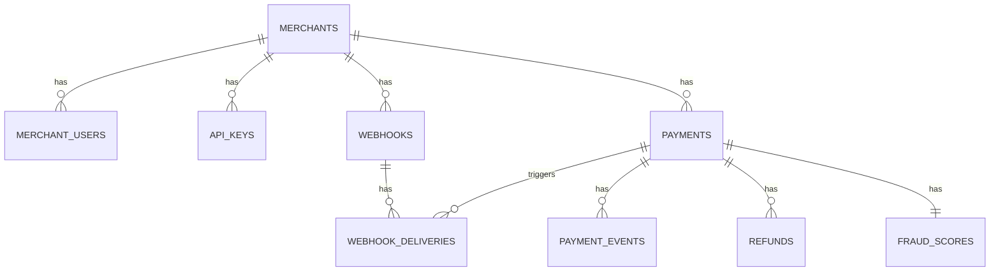

# Database Design
## PayGuard (PostgreSQL)

---

## 1. Entity Relationship Overview

```
merchants ──1:N── merchant_users
merchants ──1:N── api_keys
merchants ──1:N── webhooks
merchants ──1:N── payments
merchants ──1:N── audit_logs

payments ──1:N── payment_events
payments ──1:N── refunds
payments ──1:1── fraud_scores
payments ──1:N── webhook_deliveries (via webhooks)

webhooks ──1:N── webhook_deliveries
```



---

## 2. Tables

### `merchants`
| Column | Type | Notes |
|---|---|---|
| id | UUID PK | |
| business_name | VARCHAR(255) | |
| email | VARCHAR(255) UNIQUE | |
| status | VARCHAR(20) | `active`, `suspended` |
| created_at | TIMESTAMPTZ | |

### `merchant_users`
| Column | Type | Notes |
|---|---|---|
| id | UUID PK | |
| merchant_id | UUID FK → merchants | |
| email | VARCHAR(255) UNIQUE | |
| password_hash | VARCHAR(255) | bcrypt/argon2 |
| role | VARCHAR(20) | `merchant_admin`, `merchant_staff`, `platform_admin` |
| created_at | TIMESTAMPTZ | |

### `api_keys`
| Column | Type | Notes |
|---|---|---|
| id | UUID PK | |
| merchant_id | UUID FK → merchants | |
| key_id | VARCHAR(64) UNIQUE | visible prefix, e.g. `pk_live_4f2a...` |
| key_secret_hash | VARCHAR(255) | SHA-256 hash, never store plaintext |
| mode | VARCHAR(10) | `test`, `live` |
| status | VARCHAR(20) | `active`, `revoked` |
| last_used_at | TIMESTAMPTZ NULL | |
| created_at | TIMESTAMPTZ | |

**Index:** `key_id` (unique, for fast auth lookup)

### `customers`
| Column | Type | Notes |
|---|---|---|
| id | UUID PK | |
| merchant_id | UUID FK → merchants | customers belong to a merchant's namespace |
| email | VARCHAR(255) | |
| created_at | TIMESTAMPTZ | |

### `payments`
| Column | Type | Notes |
|---|---|---|
| id | UUID PK | |
| merchant_id | UUID FK → merchants | |
| customer_id | UUID FK → customers, NULL | |
| amount | BIGINT | smallest currency unit (e.g. paise) — never FLOAT |
| currency | VARCHAR(3) | ISO 4217, e.g. `INR` |
| status | VARCHAR(20) | `created`, `authorized`, `captured`, `flagged`, `failed`, `refunded` |
| payment_method | JSONB | mock card metadata only, no real PAN |
| idempotency_key | VARCHAR(255) | see idempotency_keys table for full record |
| created_at | TIMESTAMPTZ | |
| updated_at | TIMESTAMPTZ | |

**Indexes:** `(merchant_id, created_at DESC)` for dashboard list queries; `status` for fraud-queue filtering

### `payment_events`
Append-only state-transition log — this is what powers the timeline UI.

| Column | Type | Notes |
|---|---|---|
| id | UUID PK | |
| payment_id | UUID FK → payments | |
| from_status | VARCHAR(20) | |
| to_status | VARCHAR(20) | |
| reason | TEXT NULL | e.g. "flagged: risk_score=0.85" |
| created_at | TIMESTAMPTZ | |

### `fraud_scores`
| Column | Type | Notes |
|---|---|---|
| id | UUID PK | |
| payment_id | UUID FK → payments, UNIQUE | one score per payment |
| risk_score | NUMERIC(4,3) | 0.000–1.000 |
| model_version | VARCHAR(50) | track which model produced this — important for explainability |
| top_factors | JSONB | e.g. `["high_velocity", "new_device", "amount_outlier"]` |
| decision | VARCHAR(20) | `pass`, `flagged`, `blocked` |
| reviewed_by | UUID FK → merchant_users, NULL | analyst who approved/blocked, if manually reviewed |
| reviewed_at | TIMESTAMPTZ NULL | |
| created_at | TIMESTAMPTZ | |

### `refunds`
| Column | Type | Notes |
|---|---|---|
| id | UUID PK | |
| payment_id | UUID FK → payments | |
| amount | BIGINT | must not exceed remaining refundable amount |
| status | VARCHAR(20) | `pending`, `completed`, `failed` |
| idempotency_key | VARCHAR(255) | |
| created_at | TIMESTAMPTZ | |

### `webhooks`
| Column | Type | Notes |
|---|---|---|
| id | UUID PK | |
| merchant_id | UUID FK → merchants | |
| url | TEXT | |
| secret_hash | VARCHAR(255) | used to HMAC-sign delivered payloads |
| event_types | TEXT[] | e.g. `{payment.captured, payment.flagged}` |
| status | VARCHAR(20) | `active`, `disabled` |
| created_at | TIMESTAMPTZ | |

### `webhook_deliveries`
| Column | Type | Notes |
|---|---|---|
| id | UUID PK | |
| webhook_id | UUID FK → webhooks | |
| payment_id | UUID FK → payments | |
| event_type | VARCHAR(50) | |
| payload | JSONB | |
| attempt_count | INT | |
| last_status_code | INT NULL | HTTP status returned by merchant's endpoint |
| status | VARCHAR(20) | `pending`, `delivered`, `dead_letter` |
| next_retry_at | TIMESTAMPTZ NULL | |
| created_at | TIMESTAMPTZ | |

### `idempotency_keys`
Can live in Postgres or Redis; Postgres shown here for durability across restarts.

| Column | Type | Notes |
|---|---|---|
| key | VARCHAR(255) PK | composite in practice: `merchant_id + key` |
| merchant_id | UUID FK → merchants | |
| request_hash | VARCHAR(64) | hash of the request body, to detect key-reuse-with-different-payload |
| response_body | JSONB | cached response to replay |
| status_code | INT | |
| created_at | TIMESTAMPTZ | |
| expires_at | TIMESTAMPTZ | TTL, e.g. 24h |

### `audit_logs`
| Column | Type | Notes |
|---|---|---|
| id | UUID PK | |
| merchant_id | UUID FK → merchants, NULL | NULL for platform-level actions |
| actor_id | UUID | merchant_user or platform admin id |
| action | VARCHAR(100) | e.g. `api_key.revoked`, `fraud.approved` |
| metadata | JSONB | |
| created_at | TIMESTAMPTZ | |

---

## 3. Design Notes

- **Money as integers, always.** `amount BIGINT` in the smallest currency unit avoids floating-point rounding bugs — this is a well-known payments-engineering detail worth stating explicitly in a writeup or interview.
- **Append-only event log (`payment_events`)** rather than only mutating `payments.status` — lets you reconstruct history and power the timeline UI without extra bookkeeping.
- **`fraud_scores` is 1:1 with `payments`**, not embedded as columns on `payments` — keeps the payments table lean and makes it easy to later store multiple scoring attempts if you re-score.
- **Idempotency keys are scoped per-merchant**, not global — two different merchants can reuse the same key string safely.
